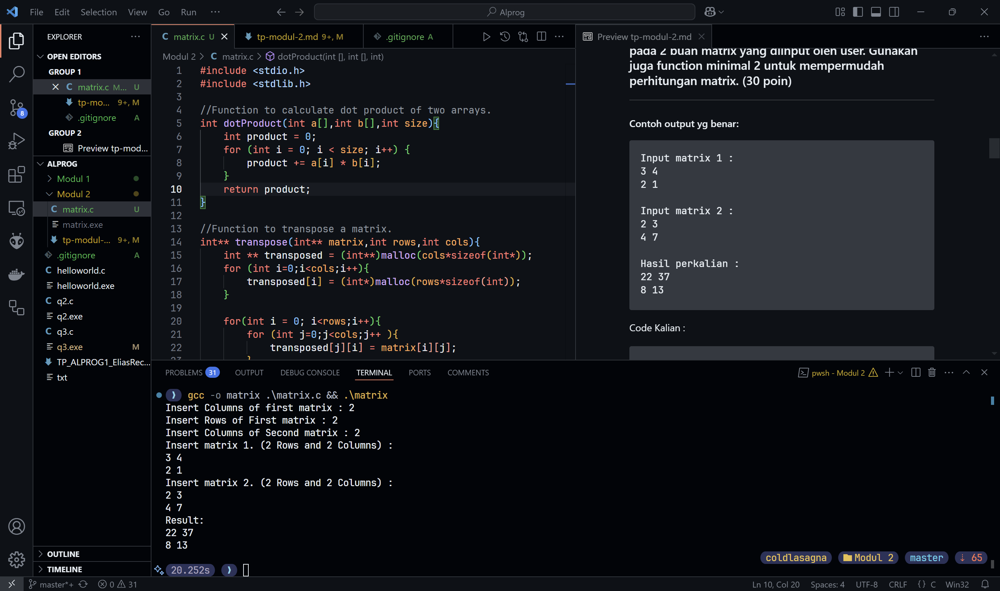
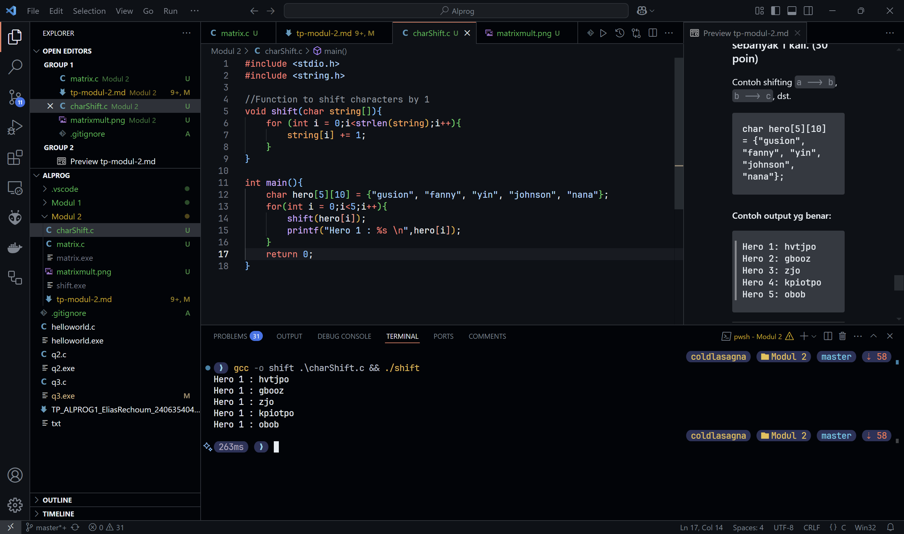

# Tugas Pendahuluan Modul 2 - Array and Function

```
Nama  : Elias Rechoum
NPM   : 2406354045
```

> Note: Soal Programming tidak perlu dicantumkan referensi, hanya soal Teori saja yang perlu referensi minimal 2.

## Teori

### 1. Jelaskan apa itu array dan keuntungan menggunakan array dibandingkan dengan variabel biasa! (10 poin)

---

[your answer here]

### Referensi:

- Contoh Situs [Online]. Available: https://www.myWebsite.com/ilovedigilab/. [Diakses: 25-Agustus-2024]
- Contoh Situs [Online]. Available: https://www.myWebsite.com/ilovedigilab/. [Diakses: 25-Agustus-2024]

---

### 2. Jelaskan apa yang dimaksud dengan array 1D dan 2D serta jelaskan perbedaan keduanya! (10 poin)

[your answer here]

### Referensi:

- Contoh Situs [Online]. Available: https://www.myWebsite.com/ilovedigilab/. [Diakses: 25-Agustus-2024]
- Contoh Situs [Online]. Available: https://www.myWebsite.com/ilovedigilab/. [Diakses: 25-Agustus-2024]

---

### 3. Jelaskan apa itu function dan bagaimana cara penggunaannya! (10 poin)

[your answer here]

### Referensi:

- Contoh Situs [Online]. Available: https://www.myWebsite.com/ilovedigilab/. [Diakses: 25-Agustus-2024]
- Contoh Situs [Online]. Available: https://www.myWebsite.com/ilovedigilab/. [Diakses: 25-Agustus-2024]

### 4. Jelaskan perbedaan antara pass-by-value dan pass-by-reference! serta jelaskan juga apa yang dimaksud dengan scope variabel dalam function (10 poin)

[your answer here]

### Referensi:

- Contoh Situs [Online]. Available: https://www.myWebsite.com/ilovedigilab/. [Diakses: 25-Agustus-2024]
- Contoh Situs [Online]. Available: https://www.myWebsite.com/ilovedigilab/. [Diakses: 25-Agustus-2024]

---

## Programming

### 1. Buatlah program yang akan melakukan perkalian pada 2 buah matrix yang diinput oleh user. Gunakan juga function minimal 2 untuk mempermudah perhitungan matrix. (30 poin)

---

#### Contoh output yg benar: 

```
Input matrix 1 :
3 4
2 1

Input matrix 2 :
2 3
4 7

Hasil perkalian :
22 37
8 13
```


Code Kalian :

```c
#include <stdio.h>
#include <stdlib.h>

//Function to calculate dot product of two arrays.
int dotProduct(int a[],int b[],int size){
    int product = 0;
    for (int i = 0; i < size; i++) {
        product += a[i] * b[i];
    }
    return product;
}

//Function to transpose a matrix.
int** transpose(int** matrix,int rows,int cols){
    int ** transposed = (int**)malloc(cols*sizeof(int*));
    for (int i=0;i<cols;i++){
        transposed[i] = (int*)malloc(rows*sizeof(int));
    }

    for(int i = 0; i<rows;i++){
        for (int j=0;j<cols;j++ ){
            transposed[j][i] = matrix[i][j];
        }
    }
    return transposed;
}

//Function to read matrix from user input
void read_matrix(int** matrix, int rows, int cols) {
    for (int i = 0; i < rows; i++) {
        for (int j = 0; j < cols; j++) {
            scanf("%d", &matrix[i][j]);
        }
    }
}


int main(){
    int rows1,columns1,rows2,columns2;
    printf("Insert Columns of first matrix : ");
    scanf("%d",&columns1);
    printf("Insert Rows of First matrix : ");
    scanf("%d",&rows1);
    printf("Insert Columns of Second matrix : ");
    scanf("%d",&columns2);
    rows2 = columns1;

    // Allocate and read matrix 1 from user
    int ** matrix1 = (int**)malloc(rows1*sizeof(int*));
    for (int i = 0;i<rows1;i++){
        matrix1[i]=(int*)malloc(columns1*sizeof(int));
    }
    printf("Insert matrix 1. (%d Rows and %d Columns) :\n",rows1,columns1);
    read_matrix(matrix1,rows1,columns1);

    // Allocate and read matrix 2 from user
    int ** matrix2 = (int**)malloc(rows2*sizeof(int*));
    for (int i = 0; i<rows2;i++){
        matrix2[i]=(int*)malloc(columns2*sizeof(int));
    }  
    printf("Insert matrix 2. (%d Rows and %d Columns) :\n",rows2,columns2);
    read_matrix(matrix2,rows2,columns2);

    // Transpose matrix2 and store it in matrix2_transposed
    int** matrix2_transposed = transpose(matrix2, rows2, columns2);

    // Store the original matrix2 pointer in temp
    int** temp = matrix2;
    
    // Set matrix2 to the transposed matrix2
    matrix2 = matrix2_transposed;
    
    // Free the original matrix2 (which is now temp)
    for (int i = 0; i < rows2; i++) {
        free(temp[i]);
    }
    free(temp);

    //Allocate memory for result matrix
    int ** result = (int**)malloc(rows1*sizeof(int*));
    for (int i = 0;i<rows1;i++){
        result[i]=(int*)malloc(columns2*sizeof(int));
    }

    //Multiply matrix1 and matrix2 using dotProduct() and store the result in result matrix
    for (int i=0;i<rows1;i++){
        for (int j=0;j<columns2;j++){
            result[i][j] = dotProduct(matrix1[i],matrix2[j],columns1);
        }

    }
    
    printf("Result: \n");
    for (int i = 0;i<rows1;i++){
        for (int j=0;j<columns2;j++){
            printf("%d ",result[i][j]);
        }
        printf("\n");
    }
    
    // Free all the allocated memory
    for (int i = 0;i<rows1;i++){
        free(matrix1[i]);
    }
    for (int i = 0;i<columns2;i++){
        free(matrix2[i]);
    }
    for (int i = 0;i<rows1;i++){
        free(result[i]);
    }
    free(matrix1);
    free(matrix2);
    free(result);

    return 0;
}
```

SS Output Program Kalian : 



### 2. Buatlah sebuah program yang mengenkripsi isi dari array berikut dengan melakukan shifting sebanyak 1 kali. (30 poin)

Contoh shifting ```a --> b```, ```b --> c```, dst.

```
char hero[5][10] = {"gusion", "fanny", "yin", "johnson", "nana"};
```

#### Contoh output yg benar: 

```
Hero 1: hvtjpo
Hero 2: gbooz
Hero 3: zjo
Hero 4: kpiotpo
Hero 5: obob
```


---

Code Kalian :

```c
#include <stdio.h>
#include <string.h>

//Function to shift characters by 1
void shift(char string[]){
    for (int i = 0;i<strlen(string);i++){
        string[i] += 1;
    }
}

int main(){
    char hero[5][10] = {"gusion", "fanny", "yin", "johnson", "nana"};
    
    //Iterate over strings in array
    for(int i = 0;i<5;i++){
        shift(hero[i]);
        printf("Hero 1 : %s \n",hero[i]);
    }
    return 0;
}
```

SS Output Program Kalian : 

