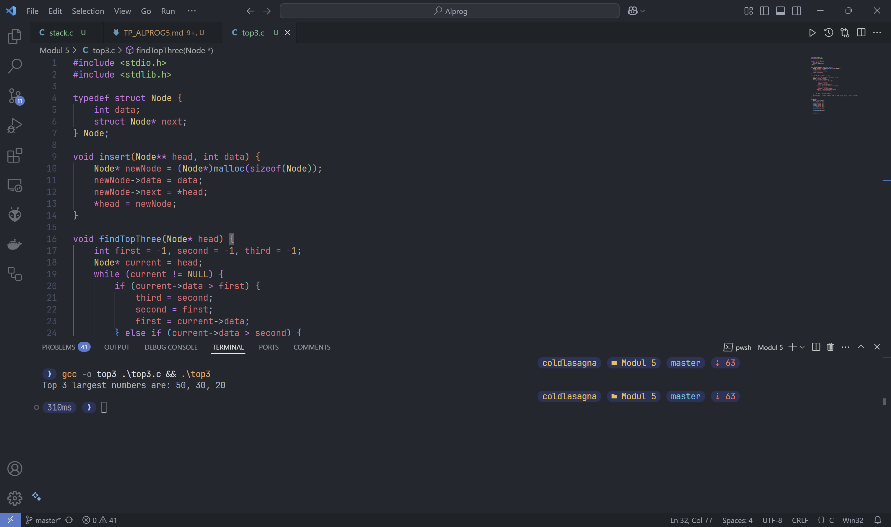
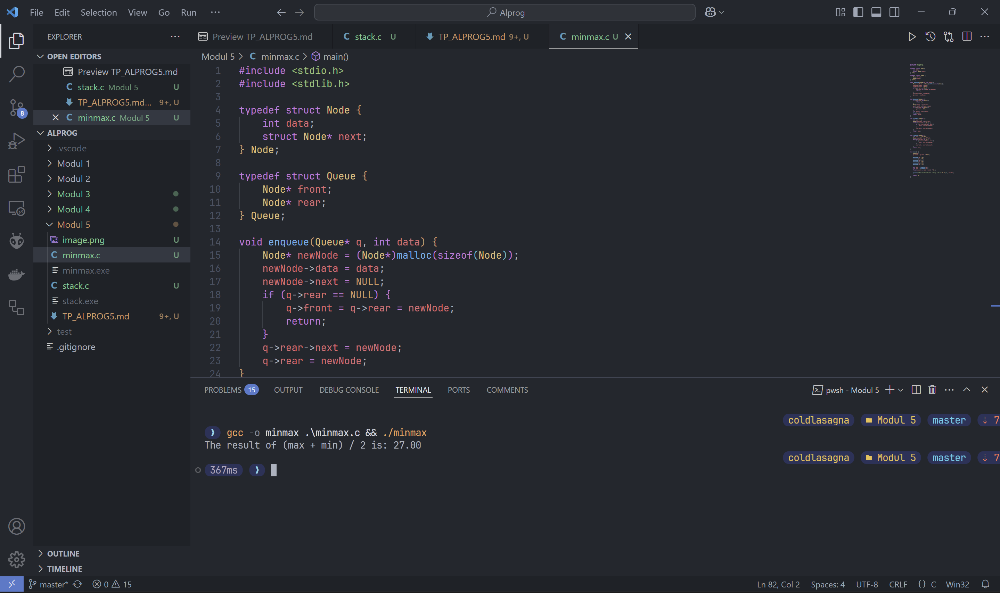
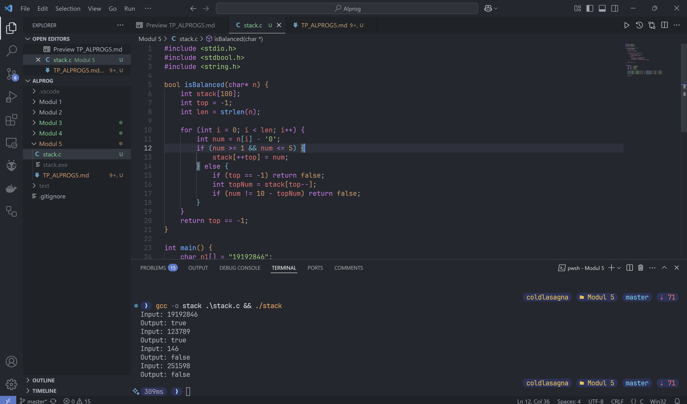

# Tugas Pendahuluan - Linked List, Stack, Queue

```
Nama  : Elias Rechoum
NPM   : 2406354045
```

> Note: Soal Programming tidak perlu dicantumkan referensi, hanya soal Teori saja yang perlu referensi minimal 2.

## Teori

### 1. Jelaskan apa itu Linked List, jenis-jenis Linked List, dan keuntungan menggunakan Linked List! (15 poin)

Linked List adalah struktur data linear yang terdiri dari sekumpulan node yang saling terhubung menggunakan pointer. Setiap node dalam Linked List terdiri dari dua bagian utama, yaitu data dan pointer ke node berikutnya.

#### Jenis-jenis Linked List:

1. **Singly Linked List**: Setiap node hanya memiliki satu pointer yang menunjuk ke node berikutnya.
2. **Doubly Linked List**: Setiap node memiliki dua pointer, satu menunjuk ke node berikutnya dan satu lagi menunjuk ke node sebelumnya.
3. **Circular Linked List**: Node terakhir dalam daftar menunjuk kembali ke node pertama, membentuk siklus.

#### Keuntungan menggunakan Linked List:

- **Dinamis**: Ukuran Linked List dapat berubah secara dinamis, tidak seperti array yang memiliki ukuran tetap.
- **Efisien dalam Insert dan Delete**: Penambahan dan penghapusan elemen dapat dilakukan dengan efisien tanpa perlu menggeser elemen lainnya.
- **Penggunaan Memori Lebih Baik**: Tidak perlu mengalokasikan memori secara statis seperti pada array.

### Referensi:

1.  J. Smith, *Data Structures and Algorithms in C++*, 2nd ed. New York: Pearson, 2019.  
2.  A. Gupta, "Introduction to Linked Lists," in *Journal of Computer Science and Technology*, vol. 35, no. 4, pp. 112-119, 2020.

---

### 2. Jelaskan apa itu Stack, contoh kode Stack, dan keuntungan menggunakan Stack! (15 poin)

Stack adalah struktur data linear yang mengikuti prinsip **LIFO (Last In, First Out)**, di mana elemen yang terakhir dimasukkan akan menjadi elemen pertama yang dikeluarkan.

#### Keuntungan menggunakan Stack:

- **Manajemen Memori Efisien**: Digunakan dalam proses rekursi dan manajemen memori otomatis.
- **Implementasi Algoritma Backtracking**: Digunakan dalam undo-redo operasi.
- **Mudah diimplementasikan**: Struktur sederhana yang dapat digunakan dalam banyak aplikasi, seperti ekspresi matematika dan traversal graf.

### Referensi:

1. T. Cormen, C. Leiserson, R. Rivest, and C. Stein, *Introduction to Algorithms*, 3rd ed. Cambridge, MA: MIT Press, 2009.  
2. M. Weiss, *Data Structures & Algorithm Analysis in Java*, 3rd ed. Boston: Pearson, 2011.

---

### 3. Jelaskan apa itu Queue, jenis-jenis Queue, dan keuntungan menggunakan Queue! (15 poin)

Queue adalah struktur data linear yang mengikuti prinsip **FIFO (First In, First Out)**, di mana elemen yang pertama masuk akan menjadi elemen pertama yang keluar.

#### Jenis-jenis Queue:

1. **Simple Queue**: Elemen ditambahkan di belakang dan dihapus dari depan.
2. **Circular Queue**: Elemen terakhir terhubung kembali ke elemen pertama untuk mengoptimalkan penggunaan ruang.
3. **Priority Queue**: Setiap elemen memiliki prioritas, sehingga elemen dengan prioritas lebih tinggi akan diproses lebih dahulu.
4. **Deque (Double-Ended Queue)**: Elemen dapat ditambahkan dan dihapus dari kedua ujung.

#### Keuntungan menggunakan Queue:

- **Efisien dalam Pemrosesan Data**: Banyak digunakan dalam manajemen antrian tugas dalam sistem operasi.
- **Mendukung Pemrosesan Paralel**: Berguna dalam sistem multi-threading.
- **Implementasi dalam Jaringan**: Digunakan dalam algoritma penjadwalan paket jaringan.

### Referensi:
1.  S. Sahni, *Data Structures, Algorithms, and Applications in C++*, 2nd ed. New York: McGraw-Hill, 2005.  
2.  R. Sedgewick and K. Wayne, *Algorithms*, 4th ed. Boston: Addison-Wesley, 2011.


## Programming

### 1. Buatlah program yang dapat mencari 3 angka terbesar menggunakan Linked List! Masukkan dulu angka-angka pada Linked List agar terisi, kemudian implementasikan fungsi untuk mencari 3 angka terbesar. Cantumkan kode program dan screenshot hasil outputnya! (10 poin)

> Untuk mengisi linked list, bebas cara untuk memasukkan angka atau langsung dihardcode juga boleh.

---

```c
#include <stdio.h>
#include <stdlib.h>

typedef struct Node {
    int data;
    struct Node* next;
} Node;

void insert(Node** head, int data) {
    Node* newNode = (Node*)malloc(sizeof(Node));
    newNode->data = data;
    newNode->next = *head;
    *head = newNode;
}

void findTopThree(Node* head) {
    int first = -1, second = -1, third = -1;
    Node* current = head;
    while (current != NULL) {
        if (current->data > first) {
            third = second;
            second = first;
            first = current->data;
        } else if (current->data > second) {
            third = second;
            second = current->data;
        } else if (current->data > third) {
            third = current->data;
        }
        current = current->next;
    }
    printf("Top 3 largest numbers are: %d, %d, %d\n", first, second, third);
}

int main() {
    Node* head = NULL;
    insert(&head, 10);
    insert(&head, 20);
    insert(&head, 4);
    insert(&head, 50);
    insert(&head, 30);
    insert(&head, 15);

    findTopThree(head);

    return 0;
}
```




### 2. Buatlah program yang dapat mencari hasil dari (angka_terbesar + angka_terkecil) / 2 menggunakan Queue! Masukkan dulu angka-angka pada Queue agar terisi, kemudian implementasikan fungsi mencari angka_terbesar dan fungsi lain untuk mencari angka_terkecil. Setelah itu, baru output hasil yang sesuai soal. Cantumkan kode program dan screenshot hasil outputnya! (10 poin)

> Untuk mengisi queue, bebas cara untuk memasukkan angka atau langsung dihardcode juga boleh.

---

```c
#include <stdio.h>
#include <stdlib.h>

typedef struct Node {
    int data;
    struct Node* next;
} Node;

typedef struct Queue {
    Node* front;
    Node* rear;
} Queue;

void enqueue(Queue* q, int data) {
    Node* newNode = (Node*)malloc(sizeof(Node));
    newNode->data = data;
    newNode->next = NULL;
    if (q->rear == NULL) {
        q->front = q->rear = newNode;
        return;
    }
    q->rear->next = newNode;
    q->rear = newNode;
}

int dequeue(Queue* q) {
    if (q->front == NULL) {
        return -1;
    }
    Node* temp = q->front;
    q->front = q->front->next;
    if (q->front == NULL) {
        q->rear = NULL;
    }
    int data = temp->data;
    free(temp);
    return data;
}

int findMax(Queue* q) {
    int max = -1;
    Node* current = q->front;
    while (current != NULL) {
        if (current->data > max) {
            max = current->data;
        }
        current = current->next;
    }
    return max;
}

int findMin(Queue* q) {
    int min = __INT_MAX__;
    Node* current = q->front;
    while (current != NULL) {
        if (current->data < min) {
            min = current->data;
        }
        current = current->next;
    }
    return min;
}

int main() {
    Queue q;
    q.front = q.rear = NULL;

    enqueue(&q, 10);
    enqueue(&q, 20);
    enqueue(&q, 4);
    enqueue(&q, 50);
    enqueue(&q, 30);
    enqueue(&q, 15);

    int max = findMax(&q);
    int min = findMin(&q);
    float result = (max + min) / 2.0;

    printf("The result of (max + min) / 2 is: %.2f\n", result);

    return 0;
}
```



### 3. Well-Balanced Numbers (35 poin)

Buatlah program di bawah ini menggunakan Stack. Sebuah sekuens angka disebut *balanced* jika suatu angka 1 diikuti oleh angka 9, angka 2 diikuti oleh angka 8, angka 3 diikuti oleh angka 7, angka 4 diikuti oleh angka 6, dan angka 5 diikuti oleh angka 5. **Angka yang mengikuti** harus menutup angka yang diikuti secara berurutan, misal harus "28" dan tidak bisa "278". "278" tidak dianggap *balanced* karena angka 7 tidak menutup angka 2.

Diberikan sebuah string n, tentukan apakah string tersebut *balanced* atau tidak. Jika *balanced*, kembalikan `true`, jika tidak, kembalikan `false`. Berikut testcase yang sesuai: **(tidak ada angka 0 pada input)**

#### Example
```plaintext
Input: n = "19192846"
Output: true
Explanation: All the numbers are well-balanced.

Input: n = "123789"
Output: true
Explanation: All the numbers are well-balanced.

Input: n = "146"
Output: false
Explanation: The numbers above are not well-balanced because it doesn't end with 9 to close the 1.

Input: n = "251598"
Output: false
Explanation: The numbers above are not well-balanced because it is closed with 5 first before 9.
```

---

```c
#include <stdio.h>
#include <stdbool.h>
#include <string.h>

bool isBalanced(char* n) {
    int stack[100];
    int top = -1;
    int len = strlen(n);

    for (int i = 0; i < len; i++) {
        int num = n[i] - '0';
        if (num >= 1 && num <= 5) {
            stack[++top] = num;
        } else {
            if (top == -1) return false;
            int topNum = stack[top--];
            if (num != 10 - topNum) return false;
        }
    }
    return top == -1;
}

int main() {
    char n1[] = "19192846";
    char n2[] = "123789";
    char n3[] = "146";
    char n4[] = "251598";

    printf("Input: %s\nOutput: %s\n", n1, isBalanced(n1) ? "true" : "false");
    printf("Input: %s\nOutput: %s\n", n2, isBalanced(n2) ? "true" : "false");
    printf("Input: %s\nOutput: %s\n", n3, isBalanced(n3) ? "true" : "false");
    printf("Input: %s\nOutput: %s\n", n4, isBalanced(n4) ? "true" : "false");

    return 0;
}
```

