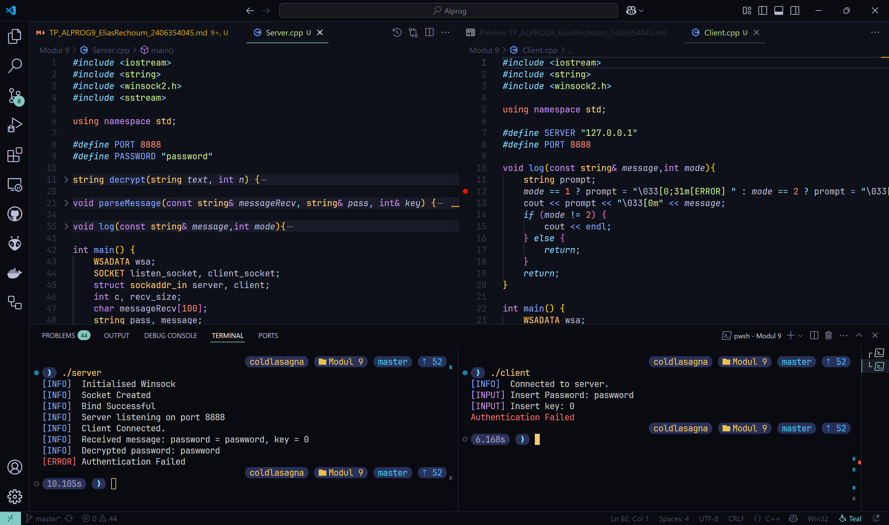

# Tugas Pendahuluan
Pembuat Soal : NS

---

```bash
Nama    : Elias Rechoum
NPM     : 2406354045
```


### Screenshot hasil run dari kedua program yang ada di dasar teori :


---

# Teori

## 1. Jelaskan apa itu socket programming dan mengapa socket programming dibutuhkan!

Socket programming adalah teknik pemrograman yang memungkinkan dua sistem (komputer) saling berkomunikasi melalui jaringan. Socket menyediakan endpoint untuk mengirim dan menerima data, dan bisa menggunakan berbagai protokol komunikasi seperti TCP (yang andal dan berorientasi koneksi) atau UDP (yang ringan dan tanpa koneksi).

### Mengapa socket programming dibutuhkan?

- Untuk memungkinkan komunikasi antara aplikasi lintas jaringan.

- Digunakan dalam pembuatan aplikasi seperti web server, aplikasi chat, game online, dan lain-lain.

- Memberikan fleksibilitas tinggi dan kontrol penuh terhadap komunikasi data.

### Contoh penggunaan

Aplikasi real-time seperti WhatsApp, Zoom, dan game multiplayer banyak menggunakan socket programming untuk komunikasi langsung antar pengguna.

#### Referensi

- [1] B. Hall, Beej's Guide to Network Programming, [Online]. Available: https://beej.us/guide/bgnet/

- [2] Oracle, “What is a Socket?”, The Java™ Tutorials, [Online]. Available: https://docs.oracle.com/javase/tutorial/networking/sockets/definition.html

## 2. Jelaskan apa itu server node dan client node pada socket programming! Jelaskan juga perbedaan antara server node dan client node!

- Server node adalah pihak yang menyediakan layanan dan menunggu permintaan koneksi dari client. Ia membuka dan mendengarkan pada port tertentu, serta menerima koneksi dari client.

- Client node adalah pihak yang menginisiasi koneksi ke server untuk meminta layanan.

| **Peran**   | **Server** (Menyediakan layanan) | **Client** (Meminta layanan) |
|-------------|----------------------------------|--------------------------------|
| **Proses**  | listen → accept koneksi         | connect ke alamat server      |
| **Contoh**  | Web server, game server         | Browser, game client          |

#### Referensi

- [3] R. Stevens, UNIX Network Programming, Volume 1: The Sockets Networking API, 3rd ed., Addison-Wesley, 2003.

## 3. Jelaskan bagaimana proses server node dan client node saling berkomunikasi melalui jaringan dari awal hingga akhir! (Dapat menggunakan flowchart untuk membantu dalam penjelasan)

Berikut adalah proses komunikasi antara server dan client menggunakan socket:

Langkah-langkah komunikasi:

1. Server membuat socket dan melakukan bind ke alamat dan port.

2. Server melakukan listen untuk menunggu koneksi masuk.

3. Client membuat socket dan melakukan connect ke alamat server.

4. Server menerima koneksi dengan accept.

5. Komunikasi data dilakukan dua arah (send dan recv).

6. Setelah selesai, kedua pihak menutup koneksi (close).

#### Referensi

- [1] B. Hall, Beej's Guide to Network Programming, [Online]. Available: https://beej.us/guide/bgnet/

- [3] R. Stevens, UNIX Network Programming, 2003.

## 4. Jelaskan apa itu stream socket dan datagram socket! Jelaskan juga kapan masing - masing jenis socket digunakan dan perbedaan dari kedua socket tersebut!

- Stream socket (SOCK_STREAM): menggunakan TCP. Memberikan koneksi yang andal, berurutan, dan bebas duplikasi. Digunakan ketika integritas data sangat penting.

- Datagram socket (SOCK_DGRAM): menggunakan UDP. Tidak menjamin urutan atau keandalan pengiriman. Lebih cepat dan ringan, cocok untuk aplikasi yang mentoleransi kehilangan data.

| **Tipe Socket**       | **Stream Socket (TCP)**       | **Datagram Socket (UDP)**    |
|------------------------|-------------------------------|-------------------------------|
| **Protokol**          | TCP                           | UDP                           |
| **Koneksi**           | Ya (connection-oriented)      | Tidak (connectionless)        |
| **Keandalan**         | Tinggi                        | Rendah                        |
| **Kecepatan**         | Lebih lambat                  | Lebih cepat                   |
| **Contoh Aplikasi**   | Web, Email, File Transfer     | VoIP, Streaming, Gaming       |


# Praktikal

## 5. Buatlah sebuah program server node dan client node dengan spesifikasi berikut :

- Server dan client berkomunikasi secara dua arah

- Client node mengirimkan sebuah kata dengan suatu angka yang akan di proses oleh server node

- Server node akan melakukan caesar cipher pada kata yang dikirimkan oleh client dan digeser ke kanan sebanyak angka yang dikirimkan oleh client

    - Jika password yang ada di server node dan hasil caesar cipher sama, maka server akan mengirimkan "Success" ke client

    - Jika password yang ada di server node dan hasil caesar cipher berbeda, maka server akan mengirimkan "Failed" ke client

- Input pada client hanya berupa lowercase letter

- Password pada server di hardcode sebagai variable

### Hasil run program:

#### Case berhasil


#### Case gagal



### Source Code

#### `Server.cpp`

```cpp
#include <iostream>
#include <string>
#include <winsock2.h>
#include <sstream>

using namespace std;

#define PORT 8888
#define PASSWORD "password"

string decrypt(string text, int n) {
    string result = "";

    for (int i = 0; i < text.length(); i++) {
        result += char((int(text[i] - 97 + n)  % 26) + 97);
    }

    return result;
}

void parseMessage(const string& messageRecv, string& pass, int& key) {
    stringstream ss(messageRecv);
    string temp;

    getline(ss, temp, ' ');
    pass = "";
    for (int x = 0; x < temp.length(); x++) {
        pass += char(tolower(temp[x]));
    }

    getline(ss, temp, ' ');
    key = atoi(temp.c_str());
}

void log(const string& message,int mode){
    string prompt;
    mode == 1 ? prompt = "\033[0;31m[ERROR] " : mode == 2 ? prompt = "\033[0;35m[INPUT] ": prompt = "\033[0;34m[INFO]  ";
    cout << prompt << "\033[0m" << message << endl;
    return;
}

int main() {
    WSADATA wsa;
    SOCKET listen_socket, client_socket;
    struct sockaddr_in server, client;
    int c, recv_size;
    char messageRecv[100];
    string pass, message;
    int key;

    if (WSAStartup(MAKEWORD(2,2), &wsa) != 0) {
        log("Startup Failed.",1);
        return 1;
    }
    log("Initialised Winsock",0);

    listen_socket = socket(AF_INET, SOCK_STREAM, 0);
    if (listen_socket == INVALID_SOCKET) {
        log("Socket creation failed.",1);
        return 1;
    }
    log("Socket Created",0);

    server.sin_family = AF_INET;
    server.sin_addr.s_addr = INADDR_ANY;
    server.sin_port = htons(PORT);

    if (bind(listen_socket, (struct sockaddr *)&server, sizeof(server)) == SOCKET_ERROR) {
        log("Bind failed.",1);
        return 1;
    }
    log("Bind Successful",0);

    listen(listen_socket, 3);

    log("Server listening on port " + to_string(PORT),0);

    c = sizeof(struct sockaddr_in);
    client_socket = accept(listen_socket, (struct sockaddr *)&client, &c);
    if (client_socket == INVALID_SOCKET) {
        log("Accept failed.",1);
        return 1;
    }
    
    log("Client Connected.",0);

    recv_size = recv(client_socket, messageRecv, sizeof(messageRecv), 0);
    if (recv_size == SOCKET_ERROR) {
        log("Recv failed.",1);
        return 1;
    }

    messageRecv[recv_size] = '\0';

    parseMessage(messageRecv, pass, key);

    log("Received message: password = " + pass + ", key = " + to_string(key) ,0);


    string decrypted = decrypt(pass, key);
    log("Decrypted password: " + decrypted,0);

    if (decrypted == PASSWORD) {
        log("Authentication Successful",0);
        message = "\033[0;32mAuthentication Successful";
    }
    else{
        log("Authentication Failed",1);
        message = "\033[0;31mAuthentication Failed";
    }
    send(client_socket,message.c_str(),sizeof(message),0);

    closesocket(client_socket);
    closesocket(listen_socket);

    WSACleanup();

    return 0;
}
```
---

#### `Client.cpp`

```cpp
#include <iostream>
#include <string>
#include <winsock2.h>

using namespace std;

#define SERVER "127.0.0.1"
#define PORT 8888

void log(const string& message,int mode){
    string prompt;
    mode == 1 ? prompt = "\033[0;31m[ERROR] " : mode == 2 ? prompt = "\033[0;35m[INPUT] ": prompt = "\033[0;34m[INFO]  ";
    cout << prompt << "\033[0m" << message;
    if (mode != 2) {
        cout << endl;
    } else {
        return;
    }
    return;
}

int main() {
    WSADATA wsa;
    SOCKET client_socket;
    struct sockaddr_in server;
    string password;
    char serverReply[2000];
    int key;

    if (WSAStartup(MAKEWORD(2,2), &wsa) != 0) {
        log("Startup Failed.",1);
        return 1;
    }

    client_socket = socket(AF_INET, SOCK_STREAM, 0);
    if (client_socket == INVALID_SOCKET) {
        log("Socket creation failed.",1);
        return 1;
    }

    server.sin_family = AF_INET;
    server.sin_port = htons(PORT);
    server.sin_addr.s_addr = inet_addr(SERVER);

    if (connect(client_socket, (struct sockaddr *)&server, sizeof(server)) == SOCKET_ERROR) {
        log("Connection to server failed.",1);
        return 1;
    }

    log("Connected to server.",0);

    log("Insert Password: ",2);

    cin >> password;

    log("Insert key: ",2);

    cin >> key;

    string messageSend = password + " " + to_string(key);

    if (send(client_socket, messageSend.c_str(), messageSend.length(), 0) == SOCKET_ERROR) {
        log("Send Failed",1);
        return 1;
    }

    int recv_size = recv(client_socket, serverReply, sizeof(serverReply), 0);

    serverReply[recv_size] = '\0';

    cout << serverReply << endl;

    closesocket(client_socket);

    WSACleanup();

    return 0;
}
```
